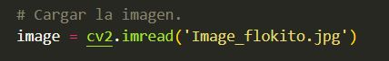

# VisionArtificial

## Objetivo
Este proyecto utiliza técnicas de visión artificial para detectar objetos en una imagen utilizando la biblioteca OpenCV.

## Requisitos
- Python 3.x
- Visual Studio Code
- OpenCV

## Instrucciones
1. Clona este repositorio.
2. Abre el proyecto en Visual Studio Code.
3. Instala las dependencias necesarias usando `pip install opencv-python`.
4. Ejecuta el script `detect_objects.py` y sigue las instrucciones para cargar y procesar imágenes.

## Ejemplo de Uso

